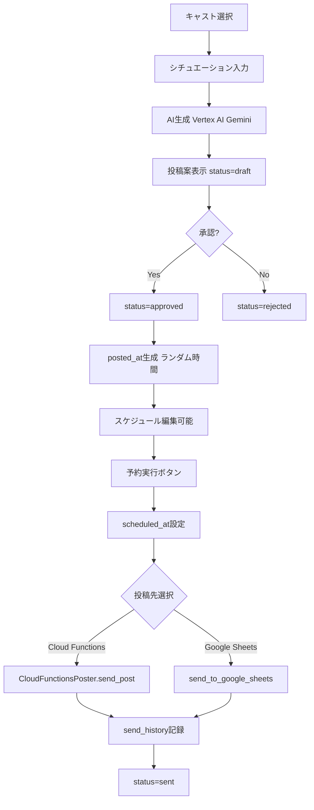

# AIcast Room - 現在のStreamlit仕様書

> 作成日: 2025年10月26日  
> ファイル: app.py (7281行)

## 📋 目次

1. [コア機能](#コア機能)
2. [データベース構造](#データベース構造)
3. [主要クラス](#主要クラス)
4. [投稿フロー](#投稿フロー)
5. [UI構成](#ui構成)
6. [シンプル化候補](#シンプル化候補)

---

## コア機能

### 1. キャスト管理
- **キャスト一覧表示** (`📋 キャスト一覧`)
- **キャスト詳細編集**
  - 基本情報（name, nickname, character, tone, story）
  - 詳細ペルソナ（動的フィールド追加可能）
  - アカウント運営指針（mission, persona_design, content_strategy等）
  - サンプルプロフィール
  - キャラクター詳細設定
  - X API認証情報
  - サンプル投稿管理（カテゴリ別）
- **インポート/エクスポート機能**
  - 基本情報のCSV
  - サンプル投稿のCSV

### 2. 投稿生成
- **AIによる投稿生成** (`🎨 投稿案生成`)
  - Vertex AI Gemini使用
  - シチュエーション指定 or カスタム指示
  - 文字数制限（デフォルト140文字）
  - プロンプト構築: ペルソナ + 運営指針 + サンプル投稿 + 生成ルール
- **生成済み投稿管理** (`📝 生成済み投稿`)
  - ステータス: draft / approved / rejected / sent
  - 承認/却下/編集/削除
  - クイックアクション（承認・却下ボタン）
- **画像生成機能**（統合済み）
  - テキストから画像生成
  - 画像付き投稿

### 3. 投稿実行
- **投稿先選択システム** (`DualPostingSystem`)
  - Google Sheets送信（レガシー）
  - Cloud Functions送信（推奨）
  - X API直接送信（開発中）
- **スケジュール投稿**
  - 日時指定
  - 送信履歴記録（send_history テーブル）

### 4. リツイート・引用ツイート
- **リツイート予約作成** (`🔄 リツイート・引用ツイート予約`)
  - Tweet ID指定
  - コメント生成（AI）
  - スケジュール設定
- **予約一覧管理**
  - Cloud Functions予約
  - Google Sheets予約
  - 再スケジュール、即実行、削除機能
  - 重複エラー対応オプション

### 5. グローバル指針管理
- **グローバル指針** (`🌍 グローバル指針`)
  - 全キャスト共通のガイダンス
  - カテゴリ別指針設定
  - トーン、マーケティング、エンゲージメント等

### 6. 設定管理
- **アプリ設定** (`⚙️ アプリ設定`)
  - Google Sheets OAuth設定
  - Vertex AI OAuth設定
  - カスタム項目追加/削除（動的スキーマ）
  - 投稿先デフォルト設定
- **キャスト別設定**
  - X API認証情報
  - Google Sheets設定（アクション別）
  - Cloud Functions URL

---

## データベース構造

### テーブル一覧

#### 1. `casts` - キャスト情報
```sql
CREATE TABLE casts (
    id INTEGER PRIMARY KEY,
    name TEXT NOT NULL,
    nickname TEXT,
    character TEXT,
    tone TEXT,
    story TEXT,
    -- 動的に追加されるカラム
    x_account_id TEXT,
    -- その他詳細ペルソナフィールド
)
```

#### 2. `posts` - 投稿管理
```sql
CREATE TABLE posts (
    id INTEGER PRIMARY KEY,
    cast_id INTEGER,
    content TEXT,
    status TEXT, -- draft/approved/rejected/sent
    theme TEXT,
    advice TEXT,
    free_advice TEXT,
    evaluation TEXT,
    created_at TIMESTAMP,
    generated_at TIMESTAMP,
    sent_at TIMESTAMP,
    posted_at TIMESTAMP,      -- 投稿予定時刻
    scheduled_at TIMESTAMP,   -- スケジュール確定時刻
    sent_status TEXT,         -- 送信状態
    FOREIGN KEY (cast_id) REFERENCES casts(id)
)
```

#### 3. `send_history` - 送信履歴
```sql
CREATE TABLE send_history (
    id INTEGER PRIMARY KEY,
    post_id INTEGER,
    cast_id INTEGER,
    destination TEXT, -- sheets/cloud_functions/x_api
    sent_at TIMESTAMP,
    status TEXT,      -- success/failed
    error_message TEXT
)
```

#### 4. `retweet_schedules` - リツイート予約
```sql
CREATE TABLE retweet_schedules (
    id INTEGER PRIMARY KEY,
    cast_id INTEGER,
    tweet_id TEXT,
    comment TEXT,
    scheduled_datetime TIMESTAMP,
    status TEXT,      -- pending/completed/failed/cancelled
    created_at TIMESTAMP,
    executed_at TIMESTAMP,
    error_message TEXT,
    destination TEXT  -- cloud_functions/sheets
)
```

#### 5. その他のテーブル
- `account_mission` - アカウント運営指針
- `detailed_persona` - 詳細ペルソナ
- `sample_profile` - サンプルプロフィール
- `sample_posts` - サンプル投稿
- `sample_post_categories` - サンプル投稿カテゴリ
- `cast_x_credentials` - X API認証情報
- `cast_sheets_config` - Google Sheets設定
- `global_guidance` - グローバル指針
- `category_guidance` - カテゴリ別指針
- `cast_groups` - キャストグループ
- `group_settings` - グループ設定
- `app_settings` - アプリ設定

---

## 主要クラス

### `CloudFunctionsPoster`
- Cloud Functionsへの投稿送信
- エンドポイント: `/x_poster`
- 環境変数: `CLOUD_FUNCTIONS_URL`

### `DualPostingSystem`
- 投稿先の統合管理
- `send_post()`: 投稿実行
- `record_send_history()`: 送信履歴記録
- `get_send_history()`: 送信履歴取得

---

## 投稿フロー

### 基本フロー（Streamlit現行）



### スケジュール投稿の詳細フロー

```
1. 投稿生成時
   - posted_at: ランダムな時間（朝7-11時、昼12-15時、夜18-22時）
   - 今日の日付 + 生成された時間帯

2. 承認時
   - scheduled_at: posted_atの日時をコピー
   - UIで日時編集可能

3. 予約実行時
   - 「予約実行」ボタンクリック
   - scheduled_atが確定
   - 予約一覧に表示

4. 送信実行
   - Cloud Functions or Google Sheetsに送信
   - send_history記録
   - status=sent, sent_at更新
```

---

## UI構成

### サイドバーメニュー

```
🏠 ホーム
📋 キャスト一覧
🎨 投稿案生成
📝 生成済み投稿
📅 スケジュール投稿管理
🔄 リツイート・引用ツイート予約
🌍 グローバル指針
⚙️ アプリ設定
📊 データ管理
```

### 各ページの主要機能

#### 1. ホーム (`🏠 ホーム`)
- 概要説明
- クイックアクセスボタン

#### 2. キャスト一覧 (`📋 キャスト一覧`)
- キャスト一覧カード表示
- 新規キャスト作成
- 詳細編集（モーダル風）

#### 3. 投稿案生成 (`🎨 投稿案生成`)
- キャスト選択
- シチュエーション入力 or カスタム指示
- 文字数制限設定
- AI生成実行
- 生成結果表示・保存

#### 4. 生成済み投稿 (`📝 生成済み投稿`)
- ステータス別フィルター
- キャスト別フィルター
- 投稿カード（承認・却下・編集・削除）
- 一括操作

#### 5. スケジュール投稿管理 (`📅 スケジュール投稿管理`)
- approved状態の投稿一覧
- スケジュール編集
- 投稿先選択
- 送信実行

#### 6. リツイート予約 (`🔄 リツイート・引用ツイート予約`)
- 予約作成フォーム
- 予約一覧（Cloud Functions / Google Sheets）
- 予約管理（再スケジュール、即実行、削除）

#### 7. グローバル指針 (`🌍 グローバル指針`)
- グローバル指針一覧
- カテゴリ別指針管理
- 新規作成・編集・削除

#### 8. アプリ設定 (`⚙️ アプリ設定`)
- OAuth設定（Google Sheets, Vertex AI）
- カスタム項目管理
- 投稿先デフォルト設定
- X API設定

---

## シンプル化候補

### 🔴 削除・統合候補（優先度高）

#### 1. OAuth認証の複雑性
**現状**: 3種類のOAuth設定関数
```python
- setup_google_sheets_oauth_simple()
- setup_vertex_ai_oauth_simple()
- setup_google_sheets_oauth()
```
**問題点**:
- 重複コード多数
- UI上のガイダンスが冗長
- 認証エラー時のハンドリングが複雑

**提案**: 
- ✅ **環境変数で一元管理**（ADC推奨）
- ❌ UI上のOAuth設定を削除
- 📝 README.mdに認証手順を集約

#### 2. 投稿先システムの二重化
**現状**: 3つの投稿先
```python
- Google Sheets（レガシー）
- Cloud Functions（推奨）
- X API直接（開発中）
```
**問題点**:
- 設定画面が複雑
- 送信ロジックが分散
- メンテナンスコスト高

**提案**:
- ✅ **Cloud Functionsに一本化**
- ❌ Google Sheets送信を削除（または非推奨化）
- ❌ X API直接送信は別機能として分離

#### 3. 動的フィールド機能
**現状**: カスタム項目をDBに動的追加可能
```python
- add_column_to_casts_table()
- remove_column_from_casts_table()
```
**問題点**:
- スキーマ変更が頻発
- データ整合性リスク
- UI複雑化

**提案**:
- ✅ **固定スキーマに変更**
- ✅ カスタム項目は`JSON`カラムで管理
- 📝 標準フィールドのみUI表示

#### 4. リツイート機能の複雑性
**現状**: 
- 予約作成
- コメント生成（AI）
- スケジュール管理
- 重複エラー対応
- 再スケジュール機能

**問題点**:
- 投稿機能と分離されている
- UIが複雑（タブ切り替え多数）
- エラーハンドリングが重い

**提案**:
- ⚠️ **リツイート機能を別モジュール化** or **簡易版に縮小**
- ✅ コメント生成のみ残す
- ❌ スケジュール機能は投稿と統合

#### 5. データ管理機能
**現状**:
- キャスト情報のインポート/エクスポート
- サンプル投稿のCSV管理
- Google Drive連携

**問題点**:
- 使用頻度が低い
- UIスペースを占有
- コード量が多い（~500行）

**提案**:
- ⚠️ **別ツール化**（CLIスクリプト or 管理ページ）
- ✅ 基本的なエクスポートのみ残す
- ❌ Google Drive連携は削除

#### 6. グローバル指針の階層構造
**現状**:
- グローバル指針
- カテゴリ別指針
- キャスト個別設定
- グループ設定

**問題点**:
- 設定項目が多すぎる
- 優先順位が不明確
- UI上の導線が複雑

**提案**:
- ✅ **2階層に簡略化**（グローバル + キャスト個別）
- ❌ グループ設定を削除
- 📝 カテゴリ別指針は任意（デフォルト無効）

---

### 🟡 簡略化候補（優先度中）

#### 7. サンプル投稿管理
**現状**: カテゴリ別にサンプル投稿を大量管理
**提案**: 最大10件程度に制限 + カテゴリ統合

#### 8. キャスト詳細ペルソナ
**現状**: 15以上のフィールド
**提案**: 必須5項目 + オプション3項目に集約

#### 9. 投稿評価機能
**現状**: `evaluation`, `advice`, `free_advice`カラム
**提案**: 使用状況を確認 → 未使用なら削除

---

### 🟢 残すべき機能（コア）

1. ✅ **キャスト管理**（CRUD）
2. ✅ **投稿生成**（AI）
3. ✅ **投稿承認フロー**（draft → approved → sent）
4. ✅ **スケジュール投稿**（日時指定 + Cloud Functions送信）
5. ✅ **送信履歴**（send_history）
6. ✅ **基本的なペルソナ設定**（name, nickname, character, tone, story）

---

## 次のステップ

### フェーズ1: 調査・仕様確定
1. ✅ 現在の機能を洗い出し（本ドキュメント）
2. 🔲 実際の使用状況を確認
   - どの機能が実際に使われているか？
   - どの設定項目が必須か？
3. 🔲 シンプル化の優先順位決定
4. 🔲 新しい仕様書作成（`SIMPLE_SPEC.md`）

### フェーズ2: 段階的リファクタリング
1. 🔲 不要機能の削除（Git履歴で復旧可能）
2. 🔲 投稿先をCloud Functionsに統一
3. 🔲 OAuth設定の簡略化
4. 🔲 動的フィールドの固定化

### フェーズ3: UI最適化
1. 🔲 サイドバーメニューの整理
2. 🔲 不要なタブ・セクションの削除
3. 🔲 エラーメッセージの簡略化

### フェーズ4: コード整理
1. 🔲 関数の統合・削除
2. 🔲 モジュール分割（posting.py, cast_manager.py等）
3. 🔲 行数削減目標: **7281行 → 3000行以下**

---

## 質問リスト（ユーザーに確認）

1. **投稿先について**
   - Google Sheetsへの送信は今後も使いますか？
   - X API直接送信は必要ですか？（Cloud Functionsで十分？）

2. **リツイート機能について**
   - リツイート予約は頻繁に使いますか？
   - コメント生成だけあれば良いですか？

3. **データ管理について**
   - CSV インポート/エクスポートは必須ですか？
   - Google Drive連携は使っていますか？

4. **カスタム項目について**
   - 動的にフィールドを追加する機能は本当に必要ですか？
   - 固定スキーマで問題ないですか？

5. **グローバル指針について**
   - カテゴリ別指針は使っていますか？
   - グループ設定は使っていますか？

6. **投稿評価について**
   - `evaluation`, `advice`, `free_advice`カラムは使っていますか？

---

## 参考情報

- メインファイル: `/workspaces/aicast-app/app.py` (7281行)
- データベース: `/workspaces/aicast-app/casting_office.db`
- 仕様書: `/workspaces/aicast-app/.github/copilot-instructions.md`
- 機能更新: `/workspaces/aicast-app/FEATURE_UPDATES_2025_10_07.md`
